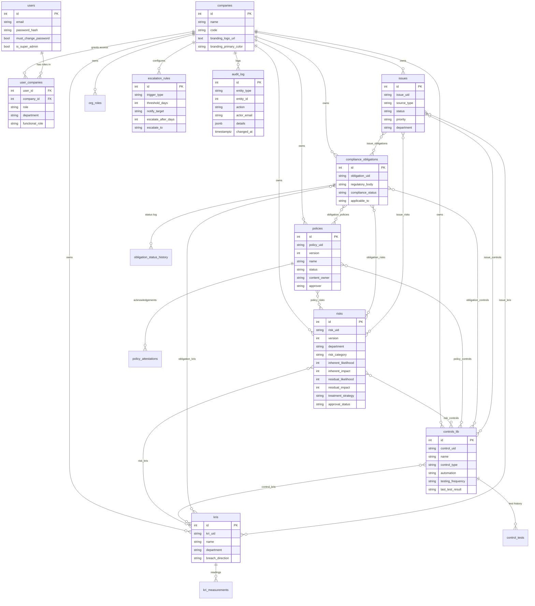

# Architecture Overview

This document is the technical handover reference for the GRC Workstation
(G11): how the system is put together, how data flows through it, and
where each spec requirement lives in the codebase. Pair this with
`API_REFERENCE.md` (endpoint catalog) and `deploy/README.md` (deployment).

## 1. Tech stack

- **Backend**: Node.js + Express (`server.js`, ~3,600 lines), `pg` for
  PostgreSQL access, `bcryptjs` for password hashing.
- **Database**: PostgreSQL 15. Schema is split into versioned files
  (`schema_v2.sql` ... `schema_v8_additions.sql`), each idempotent
  (`CREATE TABLE IF NOT EXISTS` / `ADD COLUMN IF NOT EXISTS`), applied in
  order by `migrate-all.js` for fresh installs or by `migrate-vN-to-vM.js`
  scripts for incremental upgrades.
- **Frontend**: React + Vite, built to static files served by Express
  from `/public`. No server-side rendering -- it's a single-page app with
  client-side routing handled in `App.jsx` (a simple `page` string state,
  not a router library).
- **Sessions**: server-side session tokens (`sessions` table), not JWTs --
  this is what makes the 10-minute sliding inactivity timeout (G8)
  enforceable server-side regardless of what the client does with its
  token.

## 2. Multi-tenancy model (G1)

"One application instance per client" is implemented as: one deployed
app + one database per client, and within that database, every business
table carries a `company_id`. A client's subsidiaries are separate rows
in `companies`, sharing the same instance.

- `users` are global to the instance (one email = one user record).
- `user_companies` is the join table granting a user a **role**
  (Admin/Manager/Viewer), optional **department** scope, and optional
  **functional_role** label, *per company*. The same person can be Admin
  of one subsidiary and Manager of another.
- On login, if a user has access to exactly one company, that company is
  auto-selected; otherwise they see a company picker. `sessions.active_company_id`
  tracks the current selection, and `req.company` (set by the
  `requireCompany` middleware) scopes every query in every route.
- A `super_admin` user (rare -- think "the consulting firm's own staff")
  bypasses `user_companies` and sees every active company as Admin.

**Department scoping**: Managers see/edit only records where
`department` matches their `user_companies.department` (or records with
`department IS NULL`, treated as "enterprise-wide" / visible to all
Managers). Admins see everything. Viewers see only the Policy Repository
and My Tasks. This is enforced via the `managerScopeClause()` helper used
across Risks, Controls, KRIs, Issues, and Obligations list/detail
endpoints.

## 3. Authentication & sessions (G8)

- Email + password, bcrypt-hashed, with a password policy
  (`validatePasswordPolicy`), reuse prevention (`password_history`, last
  5), forced rotation (`PASSWORD_MAX_AGE_DAYS`), and account lockout after
  5 failed attempts (`LOCKOUT_MINUTES`).
- `createSession` / `touchSession` / `destroySession` in `auth.js`
  centralize session lifecycle. `touchSession` is called on every
  authenticated request and enforces the sliding `SESSION_TIMEOUT_MINUTES`
  idle window.
- New users and migrated accounts get `must_change_password = true`,
  enforced by the `requirePasswordCurrent` middleware -- the API returns a
  structured `PASSWORD_CHANGE_REQUIRED` error code the frontend recognizes
  and redirects on.
- **Designed for SSO/MFA to be added later** without rearchitecting: any
  new auth method just needs to end at `createSession`. See
  `deploy/README.md`'s "Authentication architecture note" for specifics.

## 4. Data model / ER diagram

Notes on the diagram:
- Many-to-many link tables (`risk_controls`, `policy_risks`, etc.) are
  drawn as direct `}o--o{` relationships for readability rather than as
  separate boxes -- each corresponds to a real junction table with the
  name shown on the relationship.
- `risks`, `policies`, and `compliance_obligations` are **versioned**:
  each edit creates a new row with an incremented `version`, sharing the
  same `*_uid`. "Current" queries filter to `MAX(version)`. This satisfies
  G10's "corrections via new entries referencing the original, never
  overwriting" requirement.
- `mitigations`, `risk_kris`, `password_history`, and `sessions` are
  omitted from the diagram for clarity but follow the same FK patterns.

## 5. Module map (spec section -> implementation)

| Spec section | Module | Key tables | Key endpoints |
|---|---|---|---|
| A1 | Policy Repository | `policies`, `policy_attestations`, `policy_risks`, `policy_controls` | `/api/policies/*` |
| A2 | RACI / Org Roles | `org_roles`, `risks.risk_consulted/informed`, `controls_lib.accountable/consulted/informed` | `/api/org-roles` |
| B1 | Risk Register | `risks` | `/api/risks/*` |
| B2 | Control Library | `controls_lib`, `control_tests`, `risk_controls` | `/api/controls/*` |
| B3 | KRIs | `kris`, `kri_measurements`, `risk_kris`, `control_kris` | `/api/kris/*` |
| C1 | Compliance Obligations | `compliance_obligations`, `obligation_status_history`, `obligation_*` link tables | `/api/obligations/*` |
| D | Issues & Actions Tracker | `issues`, `issue_*` link tables | `/api/issues/*` |
| E / H2 | Access Control / User Admin | `user_companies`, `users` | `/api/users/*` |
| F1/F2 | Dashboards | (reads across all modules) | `/api/dashboard/*` |
| G5 | Escalation Rules & Notifications | `escalation_rules` | `/api/escalation-rules`, `/api/notifications` |
| G9 | Branding | `companies.branding_*` | `/api/branding`, `/api/companies/current/branding` |
| G10 | Audit Trail | `audit_log` | `/api/audit-log`, written via `logAudit()` everywhere |
| H1 | Bulk Import | (writes to core tables) | `/api/import/:module`, `/api/import/:module/template` |
| H6 | Data Export | (reads core tables) | `/api/export/:module` |
| H8 | Global Search | (reads core tables) | `/api/search` |

## 6. Frontend structure

`frontend/src/`:
- `App.jsx` -- top-level routing (a `page` string + `onNavigate`, no
  router library), gates on auth state (login -> forced password change
  -> company picker -> app shell).
- `AuthContext.jsx` / `api.js` -- session state, the `api` client
  (attaches the bearer token, surfaces `ApiError`), idle-timeout warning.
- `pages/` -- one file per screen, named after the nav item (e.g.
  `RiskRegister.jsx`, `IssuesTracker.jsx`, `Branding.jsx`).
- `components/` -- shared pieces: `Layout.jsx` (sidebar + shell),
  `TopBar.jsx` (global search + notifications), `DepartmentField.jsx`,
  `Sparkline.jsx`, `useBranding.js`, `scoreBadge.js`.

## 7. Cross-cutting concerns

- **Audit trail (G10)**: `logAudit()` in `auth.js` writes to `audit_log`
  on every meaningful state change (approvals, status changes, role
  changes, branding updates, bulk imports, etc.), capturing `entity_type`,
  `entity_id`, `action`, the acting user's email, a JSON `details` blob,
  and a timestamp. Nothing is ever deleted or overwritten by application
  code -- versioned entities (risks/policies/obligations) get new rows;
  everything else gets an audit entry alongside the update.
- **CSV helper (`csv.js`)**: a small hand-written parser/stringifier used
  by both bulk import (H1) and export (H6) -- no external CSV dependency.
- **Health check**: `GET /healthz` checks DB connectivity, used by Cloud
  Run (Phase 8).
